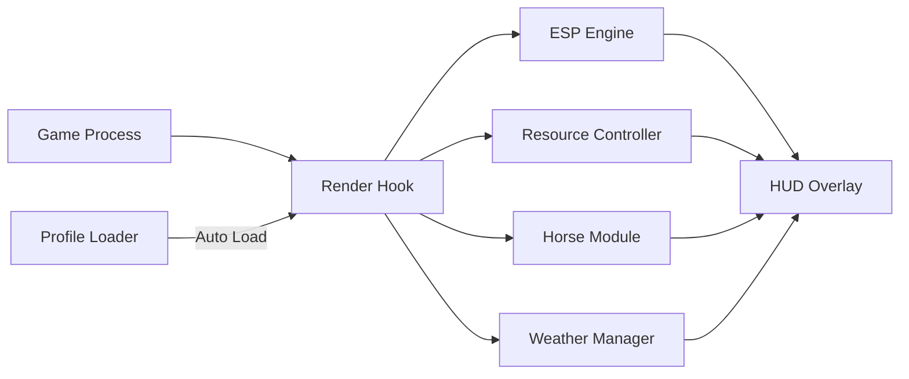

# RDR 2 Cheat 🤠

Tame the wild west your way with **RDR 2 Cheat**, a precision-built enhancement toolkit for *Red Dead Redemption 2*. This software enables advanced control over gameplay systems — from infinite stamina and gold management to wildlife tracking and AI awareness — all while maintaining game stability and realism.

Whether you’re practicing trick shots, exploring the wilderness, or optimizing your outlaw empire, this cheat suite brings convenience and mastery to every ride.

---

## 🧭 Overview

The tool integrates seamlessly with RDR 2’s DirectX and Vulkan render pipelines, reading gameplay data in real time without editing files or core memory. Its **overlay-based control panel** lets you toggle modules on the fly — offering data-rich ESP vision, hunting overlays, horse analytics, and even environmental manipulation.

It’s built for **performance, discretion, and player control**.

---

## ⚙️ Key Features

* **👁 ESP Vision:** Track NPCs, animals, bounties, and loot through terrain with customizable colors.
* **💰 Money & Gold Adjuster:** Edit wallet and satchel balances for easy resource testing.
* **🐎 Horse Stats Editor:** Maximize stamina, bonding level, and acceleration instantly.
* **🎯 Precision Aim Assist:** Fine-tune aim curve and hitbox assist for cinematic accuracy.
* **🌦 Environment Control:** Change time, weather, or fog density dynamically.
* **💨 Infinite Stamina & Dead Eye:** Explore freely and maintain full focus during long firefights.
* **🔫 Weapon Wear Manager:** Prevent degradation or toggle instant clean state.
* **🗺 Radar Overlay:** Displays nearby loot, wildlife, and lawmen in real time.

[!IMPORTANT]
All modules are external and revert automatically upon exit — ensuring no permanent edits to your save files or online accounts.

---

## 🧩 Compatibility

| System             | Support | Notes                            |
| ------------------ | ------- | -------------------------------- |
| Windows 10         | ✅       | DX11 & Vulkan support            |
| Windows 11         | ✅       | DX12-compatible                  |
| Steam Edition      | ✅       | Auto attach                      |
| Rockstar Launcher  | ✅       | Manual attach required           |
| Epic Games Edition | ⚠️      | Experimental                     |
| Vulkan API         | ✅       | Enable with `--vk-hook=on`       |
| Online Mode        | ❌       | Not supported — offline use only |

> 💡 *Tip:* Enable **HUD Dark Mode** for improved visibility of ESP outlines during night rides.

---

## ⚡ Setup Guide

1. Extract files to `C:\RDR2Cheat`.
2. Launch *Red Dead Redemption 2* normally.
3. Run the tool:

   ```bash
   RDR2Cheat.exe --inject --safe
   ```
4. Press **F8** to open the overlay.
5. Activate modules or load a `.rdr2c` configuration profile.

**Example Advanced Launch:**

```bash
RDR2Cheat.exe --profile=OutlawVision --frametime-sync --dx=12
```

[!NOTE]
If the overlay doesn’t appear, toggle between windowed and borderless fullscreen once to resync render layers.

---

## 🧠 Config Presets

**1. Outlaw Vision (Stealth + Awareness)**

```ini
[esp]
enemy_outline=on
animal_tracking=on
bounty_radius=300
color_law=#FF3B30
color_animal=#FFD700
color_loot=#00CFFF
```

**2. Frontier Explorer Mode**

```ini
[player]
stamina=infinite
deadeye=infinite
fog_density=0.5
weather=clear
time_of_day=noon
```

**3. Wealth Manager Profile**

```ini
[resources]
gold=250
cash=10000
inventory_weight_limit=unlimited
weapon_condition=clean
```

---

## 🗺 System Diagram



The modular design ensures every component — combat, economy, and ESP — runs independently for zero-lag updates during exploration or combat sequences.

---

## 🧩 Advanced Flags

| Flag               | Description                        |
| ------------------ | ---------------------------------- |
| `--safe`           | Enables protected overlay mode     |
| `--dx=12`          | Forces DirectX 12                  |
| `--vk-hook=on`     | Activates Vulkan compatibility     |
| `--frametime-sync` | Syncs overlay refresh rate         |
| `--eco`            | Runs at reduced FPS for efficiency |
| `--profile=NAME`   | Loads custom `.rdr2c` config       |

[!WARNING]
Avoid enabling *Precision Aim* and *ESP Vision* at ultra resolutions on low-end GPUs — these modules are render-intensive in cinematic scenes.

---

## ❓ FAQ

**Q1: Can I use RDR 2 Cheat online?**
A: No. This tool is for **offline/single-player only** and disables itself in online sessions.

**Q2: Will this corrupt my story save?**
A: Never. All changes are temporary and revert on exit.

**Q3: Can I save configs for specific characters?**
A: Yes — each `.rdr2c` file is unique to its profile, saved under `/profiles/`.

**Q4: Does it support controller hotkeys?**
A: Yes. Compatible with XInput devices and custom bindings.

**Q5: How often is it updated?**
A: Bi-weekly patches align with RDR 2 updates and driver optimizations.

---

## 🧭 Recommended Profiles

* **Outlaw Vision:** ESP + infinite stamina + bounty tracking.
* **Wealth Manager:** Money editor + weapon cleaner + inventory control.
* **Explorer:** Clear weather, free travel, and animal radar.

Switch via:

```bash
RDR2Cheat.exe --profile=Explorer
```

---

## 🤠 Final Thoughts

The **RDR 2 Cheat** gives every gunslinger and wanderer the control they’ve always wanted — from perfect shootouts to effortless exploration. Its secure overlay system ensures smooth gameplay and zero interference with your saves or engine performance.

Ride free. Control the frontier. Forge your legend.
